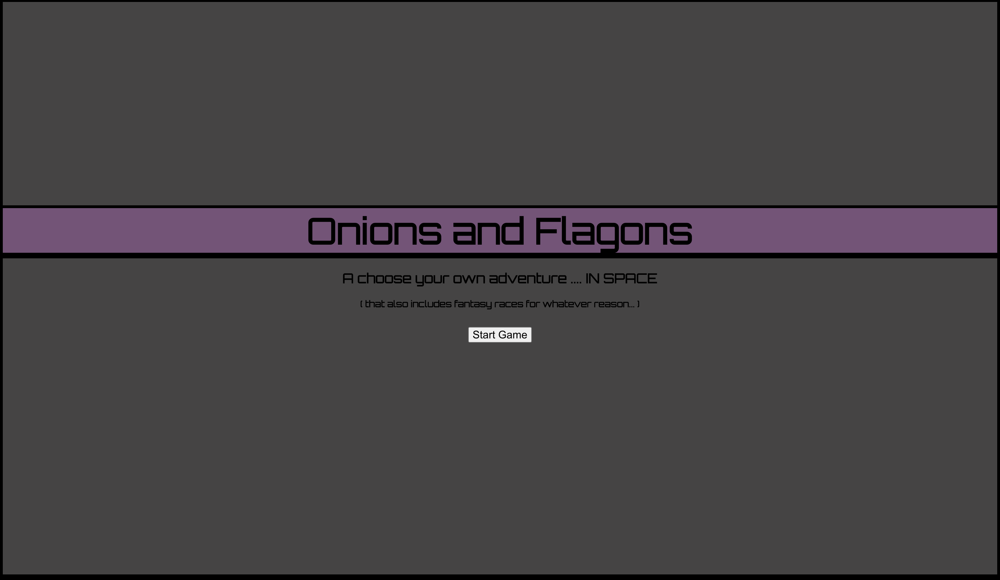
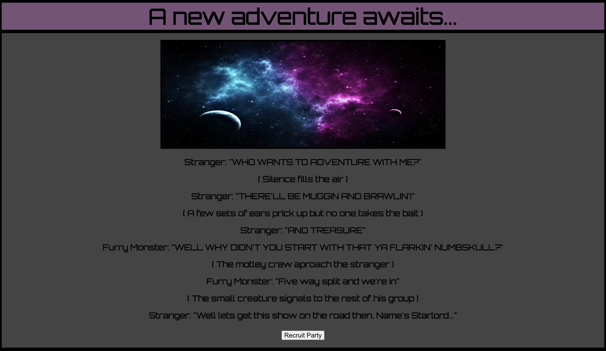
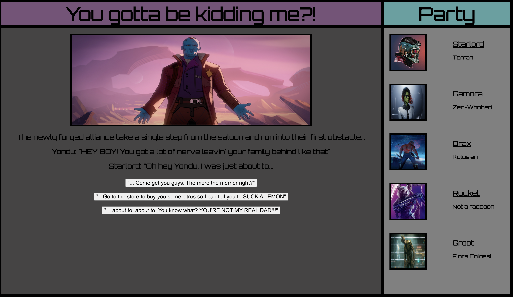

# ONIONS AND FLAGONS

A love letter to the past. Onions and Flagons pays homage to all the things I grew up loving: comic books, wrestling, point and click adventure games, and choose your own adventure books. The app primarily an interactive CYOA book with each scenario having a good, bad, and neutral response. 

The game consists of 5 scenarios and if succesful the party will get an inventory item to use against the final boss. 

## Link to game here

link to come soon

## Tools used

Entire application was made using react, javascript, CSS and imnimal html. 

## The Journey

The finished product has evolved a but since I story boarded everything. Originally I was going to have 12 charcters available and the user could make their own party of 4 Each character would have had their own strengths and weknesses which would determine if they were succesful in battle. I quickly realized that this would lead to a huge amount of branching paths and it would not be feasible to do in under a week. 

I compromised by having a set party from the get go. I usedcharcters from Marvel's Guardians Of The Galxzy franchise but they eventualy became mainstays as the scenarios came flooding in. Having them in definitely affected the tone of the dialogue and I couldn;t be happier with the outcome.

## Obstacles and Wins

I chose react I was I was not 100% comfortable using it yet. The following were the obstacles I needed to overcome:

* Storyboarding scenarios was going t be very time consuming
* The story unfold in the central component of the app and therefore I needed a lot of components to render the story. Keeping track of where everything was, was a big obstacle in the beginning
* Once I was able to get asingle scenario working, everything else fel into place. 

## Unsolved Issues

No unsolved issues on this project, just abandoned ideas such as stats for party members. 

## Link to wireframe and user stories

https://trello.com/b/uyVPBjct/onions-and-flagons

